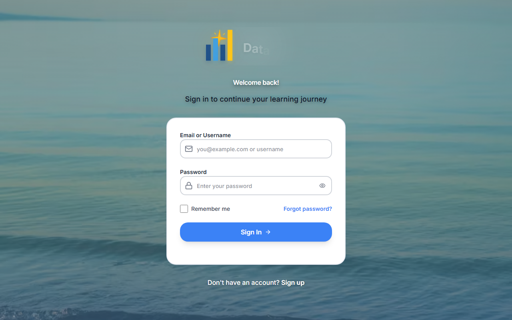
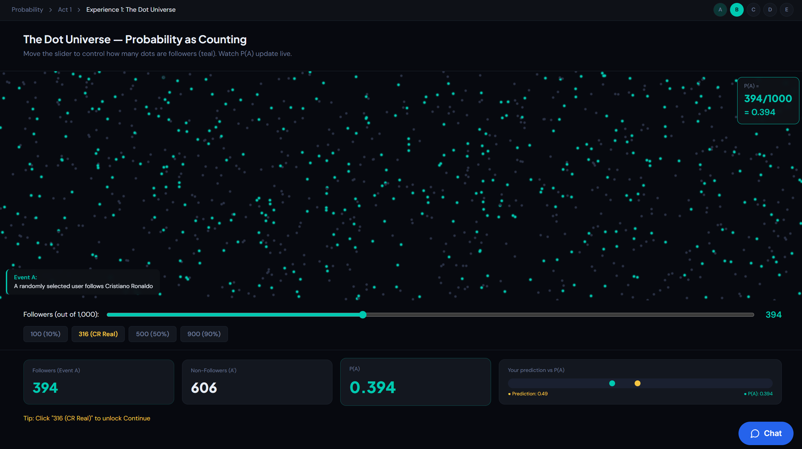
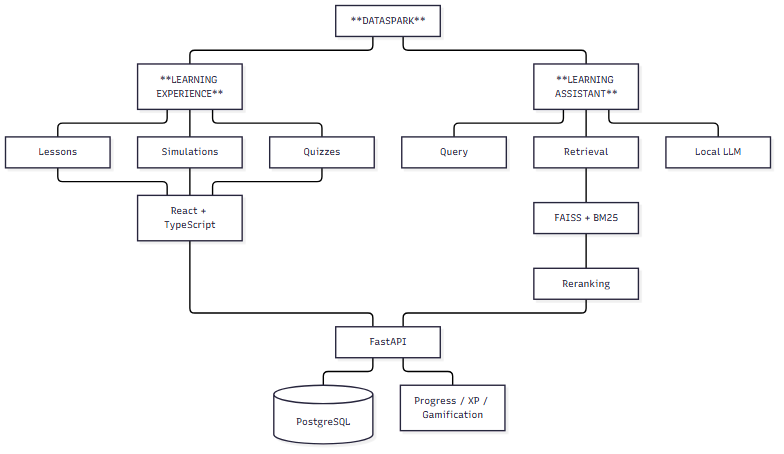

# DataSpark

An interactive statistics learning platform built around experimentation, simulation, and immediate feedback.

Statistics is often taught by showing students formulas and worked examples before asking them to solve problems on their own. DataSpark takes a different approach: students can manipulate data, run simulations, test ideas, see distributions change, and get feedback while they are learning.

Built with: **React** · **TypeScript** · **FastAPI** · **PostgreSQL** · **SQLAlchemy** · **FAISS** · **BM25** · **Ollama**

## The Problem

Statistics can be difficult to learn when students only see the finished formula or answer. Concepts like sampling variability, probability distributions, hypothesis testing, and confidence intervals become much easier to understand when students can actually experiment with them.

I built DataSpark around that idea. Instead of treating statistics as a sequence of formulas to memorize, the platform gives students ways to manipulate variables, run experiments, visualize outcomes, make predictions, and receive feedback as they work.

## How DataSpark Approaches It

DataSpark is designed to actively involve students in the learning process:
- **Interactive lessons** that visually explain complex statistical concepts.
- **Statistical simulations** that let students play with parameters and instantly observe the results.
- **Immediate feedback** loops to correct misunderstandings early.
- **Contextual learning support** powered by a completely local AI assistant that references verified curriculum.

## Product Experience

### Learn by interacting
Complex concepts like hypothesis testing and probability distributions are broken down into interactive components. Students adjust inputs and instantly see how the curves and statistics change.

### Track learning over time
Students stay engaged through a gamified progress dashboard. They earn XP, unlock achievements, and track their mastery across different statistical modules.

### Get help without leaving the lesson
A contextual learning assistant is available directly in the UI. When a student gets stuck, the local Retrieval-Augmented Generation (RAG) architecture safely fetches definitions and helps explain the concept without simply giving away the answer.

## How It Works

DataSpark is a full-stack application with a React/TypeScript client, FastAPI application layer, persistent learning-state storage, and a separate retrieval pipeline for contextual learning support.

The learning experience and AI assistant are deliberately separated. Core lessons, simulations, quizzes, progress tracking, and gamification do not depend on the assistant. The retrieval pipeline searches verified statistics material and supplies relevant context to the locally hosted language model when a student asks for help.

## Technical Highlights

- **Performant Backend**: Built asynchronously with FastAPI and `asyncpg` to handle concurrent database connections and fast response times.
- **Rich SPA Client**: A React 18 single-page application heavily typed with TypeScript and styled with Tailwind CSS, utilizing React Router and Context API for modular state management.
- **Local AI Pipeline**: A fully isolated, privacy-first RAG implementation utilizing Ollama (Llama 3), FAISS for dense vector search, BM25 for lexical search, and a Cross-Encoder for precise reranking.
- **Native Deployment**: Engineered for a native Ubuntu Linux production environment using `systemd` process managers and Nginx reverse proxying, demonstrating robust systems engineering.
- **Secure Authentication**: Built from the ground up with custom JWT handling and `bcrypt` password hashing.

## Research Foundation

DataSpark's learning methodology is directly influenced by the GAISE (Guidelines for Assessment and Instruction in Statistics Education) College Report, emphasizing statistical literacy, active learning, and the use of real data with technology.
*Read more about the pedagogical design in the [Research Foundation](docs/research-foundation.md).*

## About the Source Code

DataSpark is under active development, so the application source code is maintained in a private repository. This public repository is intended as a technical and product showcase—it documents the problem I am working on, the system architecture, the learning experience, and selected parts of the application without publishing the implementation.

The screenshots and architecture documentation here reflect the working application. I continue to develop and test the full platform privately.

## Current Status / What I'm Working On

I am currently:
- Expanding the descriptive statistics module with new interactive visualization components.
- Refining the color palette and UI system for improved accessibility.
- Writing deeper end-to-end (E2E) and contract tests to ensure the API and frontend remain robust.

## Built by

**Samuel M. Sarpong**  
[Connect on LinkedIn](https://linkedin.com/in/samuell360)
